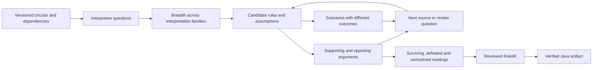

# Searching for competing legal interpretations

Research and implementation design, 22 September 2026. This extends the
[English interpretation assurance note](english-interpretation-assurance.md).
It specifies a proposed research module; the existing application still uses a
fixture drafting provider. No live-model or independent legal evaluation was
performed for this note.

The user's proposed sequence—generate different readings, investigate them, and
return several proposals with explicit uncertainty—has a close precedent in AI
and law. **AGATHA searches a space of competing case-law theories.** HYPO and CATO
supply argument moves such as analogy, distinction and counterexample. Structured
argumentation supplies a way to retain disagreement without declaring one reading
true merely because its search score is highest. Modern language-model search
methods can help generate and investigate candidates, but their scores require a
different interpretation from a legal justification.

The product should return a set of reasoned interpretations and a record of what
would distinguish them. A reviewer may resolve that set, approve a conditional
policy, or conclude that further authority is needed. Exhausting a search budget
is a legitimate stopping point; it is not evidence that every possible reading
has been considered.

## 1. The literature that most directly answers the question

### Competing theories and legal argument moves

[Bench-Capon and Sartor (2003)](https://www.csc.liv.ac.uk/~tbc/publications/aijsartor.pdf)
represent a legal theory through cases, their legally relevant factors, rules,
preferences between rules, and values that explain preferences. Section 3 defines
the representation and operations for constructing and comparing theories. These
are alternative accounts of why cases should be decided as they are, rather than
alternative wordings of an unchanged conclusion. Section 5.4 also makes a material
limit clear: their model does not fully represent the reasoning expressed in
judicial opinions. Matching outcomes alone would leave out part of what matters
for our application.

[Chorley and Bench-Capon's AGATHA](https://www.csc.liv.ac.uk/~tbc/publications/agatha.pdf)
turns this idea into search. Sections 2–4 define moves that analogize, distinguish
or counter a case; each move changes the developing theory. Sections 6–7 examine
theory evaluation and a modified A* search; section 10 uses adversarial lookahead.
The evaluation includes explanatory power, simplicity and completeness, rather
than a probability that an interpretation is legally correct. The authors explain
why their modified A* can miss the best theory. The input cases already have
factor descriptions; the paper does not solve automatic interpretation of raw
judgments.

We should borrow the explicit theory constructors, counterarguments and retained
search history. We should change the original advocacy objective: an agent must
not optimize for an outcome the bank would prefer. Opposing arguments help expose
weaknesses, but winning against an inadequately informed opponent does not justify
a regulatory interpretation. AGATHA's numerical heuristic is not a ready-made
reward function for SFC circulars.

[HYPO's Legacy (Bench-Capon, 2017)](https://www.csc.liv.ac.uk/~tbc/publications/hypoLegacy.pdf)
provides a useful historical map. Section 2 explains the exchange of a favorable
precedent, a distinction or counterexample, and a reply. Its claims lattice orders
cases by relevant dimensions: more matching facts does not automatically make a
case more on point. Sections 3.1–3.2 describe CABARET, which combines statutory
rules with case reasoning about difficult terms, and BankXX, which searches a
network of pieces of legal argument. This paper is a retrospective source; the
original CABARET and BankXX papers have not been technically audited in this turn.

### Formal disagreement without forcing a winner

A *defeasible* inference is a reason that supports a conclusion but can be
overridden when an exception or stronger contrary reason is established. For
example, an analogy with an earlier decision may support a reading, while a
material difference in the regulated activity defeats that analogy. This is
different from a mathematical implication whose stipulated premises entail its
conclusion.

[Prakken (2010), the ASPIC+ framework](https://webspace.science.uu.nl/~prakk101/pubs/aspicAF.pdf),
sections 2–3, distinguishes three attacks: disputing a premise, opposing a
conclusion, and challenging the inference connecting premises to a conclusion.
An attack becomes a successful defeat according to explicit rules and
preferences. A computed *extension* is an acceptable set of arguments under a
chosen semantics. There may be several extensions. A conclusion supported in
every extension is skeptically accepted; one supported in at least one is
credulously accepted. These terms describe consequences of the supplied argument
model, not agreement by all lawyers or a proof of the English source's meaning.

This gives us a precise reason to keep several interpretations. If arguments for
A and B defeat each other and no priority resolves the dispute, both may occur in
different preferred extensions. Neither becomes skeptically accepted merely
because a language model likes its explanation more. A small application can show
this disagreement directly rather than reducing it to a forced Boolean verdict.
The author's [correction to definition 6.8](https://webspace.science.uu.nl/~prakk101/corr.html)
must accompany any implementation relying on the paper's rationality results.
Those results are not automatically inherited by an arbitrary legal argument graph.

[Gordon, Prakken and Walton (2007), Carneades](https://webspace.science.uu.nl/~prakk101/pubs/GordonPrakkenWalton2007a.pdf),
sections 3–6, distinguish ordinary premises, assumptions and exceptions; they also
make the applicable proof standard and the dialogue's accepted or disputed
statements explicit. A premise may require supporting evidence; an assumption may
stand until challenged; an exception can defeat an otherwise supported argument.
This helps prevent an omitted definition from silently acquiring the status of an
established fact. The paper explicitly says its illustrative proof standards have
not been validated as legal proof standards. They cannot simply become the bank's
review policy. Its graphs are acyclic; newer Carneades software uses a different
evaluation model and must be assessed on its own terms.

### Search and selection of informative questions

[Yao et al. (2023), Tree of Thoughts](https://arxiv.org/abs/2305.10601v2), section 3,
separates the representation of partial reasoning, candidate generation,
evaluation and search. Its breadth-first implementation retains a beam of
candidates; it is not exhaustive breadth-first enumeration. The inspected
official code eliminates repeated strings but does not ensure different semantic
interpretations. A beam can therefore contain several paraphrases of one reading.
Our design needs explicit interpretation families in addition to ordinary beam
search. The paper's evaluations concern puzzles and writing, not regulatory
interpretation.

[Zhou et al. (2024), Language Agent Tree Search](https://arxiv.org/abs/2310.04406v3),
sections 3.2–4 and appendix A, combines Monte Carlo tree search with language-model
generation, evaluation, reflection and environment feedback. This is useful when
the next action might retrieve a source, inspect a definition, or test a formal
candidate. Its external feedback and model-based evaluation cannot be identified
with legal truth. Passing tests of a formalized rule is evidence about that rule's
execution. Repeated agreement among generations is evidence about those
generations. Neither establishes that the source has been interpreted correctly.

[Nowak (2011), generalized binary search](https://arxiv.org/abs/0910.4397v5),
Figure 1 and sections I–II, supplies another useful idea: select questions that
divide the surviving hypotheses. Its principal identification guarantees require
specific assumptions about the hypothesis space, available queries and the answer
oracle; noisy and agnostic variants have their own conditions. We cannot assume a
unique correct legal reading is in our generated set, or that a reviewer answers
without error. We can nevertheless use disagreement to select useful review
questions, without importing the paper's query-complexity guarantees.

## 2. What an interpretation hypothesis contains

A candidate must express choices that change legal consequences. Asking for ten
answers to the same prompt does not guarantee ten such choices. Begin with an
inventory of unresolved questions in the text and its incorporated sources:

| Dimension | Examples of distinct choices |
|---|---|
| Scope | Which actor, activity, product and jurisdiction are covered? |
| Vocabulary | What evidence makes a payment a gift, rebate, fee discount or return? |
| Logical structure | Does an exception qualify one item, a conjunction, or the whole arrangement? |
| Quantification and modality | All items or at least one; required, permitted or discretionary? |
| Time | Publication, commencement, transition, event time and later amendment? |
| Context | Which definition, incorporated rule, FAQ or authoritative decision supplies the missing premise? |

These dimensions are proposal generators. They do not assert that each possible
choice is legally plausible. An obvious omission of an express condition belongs
in a negative control, not in a shortlist of respectable interpretations.

Each candidate needs a structured rule, a reviewer-readable controlled-English
rendering, and the assumptions that connect its terms to the source. Preserve the
source revision, quoted spans and dependency versions, along with supporting and
opposing reasons. Identity includes those contextual bindings. Two programs can
agree on today's test examples while differing on tomorrow's amendment or on an
unseen factual classification.

There are two related structures. A search tree records operations that create or
investigate candidates. An argument graph records shared premises and reasons for
supporting or defeating them. Several candidates can depend on one disputed
definition; changing that definition must update all of them. A simple tree alone
would duplicate or lose this dependency.

## 3. A worked ambiguity from the existing SFC example

The retained [24 October 2023 circular, 23EC46](https://apps.sfc.hk/edistributionWeb/gateway/EN/circular/doc?refNo=23EC46),
paragraph 10, describes a gift restriction for product promotion and an exception
for a “discount of fees or charges.” Paragraph 9 leaves open whether some
additional returns count as gifts. The current development example has not
resolved all referenced Code and FAQ material; it also takes the relevant
classifications as supplied inputs. Its passing Java tests do not decide these
classifications.

Consider a hypothetical offer of cash back after a customer has paid a fee. Keep
the distributor and promotion scope fixed. For the following comparison only,
assume the incentive meets the gift condition unless the fee-discount exception
applies. That assumption is itself reviewable; it is not an SFC conclusion.

| Candidate definition of the exception | Directly reduced fee | Later cash rebate capped at the actual fee | Separate voucher bundled with a fee waiver |
|---|---|---|---|
| A: reduction of the fee charged; later transfers excluded | Exception applies | Exception does not apply | Voucher assessed separately |
| B: includes a documented refund of an actual fee, as well as an initial reduction | Exception applies | Exception applies if the refund conditions are met | Voucher assessed separately |
| C: any promotion containing a fee concession exempts the whole arrangement | Exception applies | Depends on how the promotion is described | Voucher exempted |

A and B are **constructed hypotheses for investigation**. We have not established
that both are legally tenable. C is a deliberately broad negative control: it
extends an item-level exception to an entire arrangement and needs an additional
justification. The system must distinguish these roles. It should not present
three generated alternatives as three accepted SFC interpretations.

The first useful question is whether the applicable Code, FAQ or other authority
treats a documented refund as a fee discount. The second is which conditions make
that classification hold: an actual fee paid, a cap, linkage to the original fee,
and treatment of any excess. These are research questions, not invented statutory
conditions. A supporting source can refine B; an exclusion can defeat it; silence
leaves the matter unresolved. Each source must have the appropriate version and
scope. Searching harder cannot turn silence into an authorization.

Now construct a discriminating scenario: a fee has actually been paid, the later
rebate equals that fee, and all other promotion and gift assumptions are fixed.
A and B produce different answers to the *specific gift restriction*. Showing
that difference is useful evidence for a reviewer. It does not decide which
definition the regulator intended, and an exception to this restriction does not
authorize the transaction under all other rules.

This is more informative than asking whether the complete generated explanation
looks reasonable. It isolates the definition whose resolution changes a decision.
The real evaluation should include source-supported ambiguities found by
independent reviewers, not just these author-constructed examples.

## 4. A search policy that preserves alternatives

First, enumerate interpretive questions and retain at least one candidate per
represented family before global ranking. Families should be defined by choices
such as exception attachment or term definition, not by prose style. Explicitly
record families still ungenerated because of budget. This is bounded breadth over
a declared grammar of choices, not a claim to enumerate every reading of English.

Next, investigate candidates through operations with visible effects: retrieve a
referenced definition, add an argument, distinguish a cited decision, challenge a
classification, or produce a scenario on which two rules disagree. A new source
may require returning to an earlier branch and creating a previously missing
family. Breadth is therefore a recurring safeguard, not just an initial prompt.

The disposition rules must distinguish different reasons for removal:

| Finding | Required action |
|---|---|
| Rule syntax or types are invalid | Reject or repair that encoding; do not infer that the underlying reading is false. |
| Checked authority contradicts a reading in the same scope and version | Record the defeating reason, its assumptions and the affected candidates; allow reopening if those premises change. |
| Two encodings are formally equivalent in a declared domain | Share computation, retaining their distinct source justifications. |
| Two candidates merely agree on sampled tests | Mark observed agreement; do not claim equivalence. |
| Low model score or exhausted allocation | Defer with its unresolved status and history; do not mark refuted. |
| Missing source, unresolved term or conflicting support | Retain the issue and require further evidence or an explicit review decision. |

Conflicting norms may be precisely what defeasible reasoning must represent.
Classical inconsistency is not a universal rule for deleting a legal reading.
Similarly, mandatory counterargument generation is an opportunity to uncover
evidence; a model's failure to produce a counterargument proves nothing about
whether one exists.

For a bounded first version, deterministic best-first investigation with family
quotas and a recorded frontier is sufficient. The next question can be selected
using scenarios that distinguish the surviving formal candidates. Let each
candidate return a decision category \(F_i(x)\) on the same eligible factual
scenario \(x\). Define

\[
G(x)=\left|\{(i,j):i<j,\ F_i(x)\ne F_j(x)\}\right|.
\]

The score counts candidate pairs separated by the question. For two total Boolean
decisions, an SMT solver can seek a witness to
\(D(x)\land(F_i(x)\ne F_j(x))\), where \(D\) contains the shared domain
constraints. A witness demonstrates different formal consequences; it is a
question for adjudication, not a source-meaning proof. No witness from a solver
timeout is an unknown result. A proved unsatisfiable query establishes equivalence
only in the specified domain and semantics. Candidates with different vocabularies
need explicit data mappings before such a comparison is meaningful.

The present runtime also has unknown inputs and scope results. A first prototype
can limit witness generation to complete facts and pure decision rules, labelling
that restriction. Extending it requires modelling every result category and the
runtime's unknown-value semantics; replacing those with ordinary Booleans would
change the problem.

If investigations become expensive enough to justify MCTS, the tree should
schedule **research actions**. A UCT-style priority combines estimated value of
an action with a visit-count exploration term:

\[
U(n)=\overline r(n)+c\sqrt{\frac{\log N(p(n))}{N(n)}}.
\]

Here \(N\) counts visits; unvisited actions require an explicit exploration rule;
\(c\) is a policy parameter; and the reward might measure verified questions
resolved per unit cost. It must not be an invented probability that a legal
reading is true. Reward definitions, stopping rules and exploration settings need
an SFC-specific evaluation. Changing authorities, human review and adaptive model
generation also prevent us from assuming standard stationary bandit guarantees.
MCTS is a candidate scheduling method, not a prerequisite for preserving multiple
interpretations.

Stop at a declared budget or after all currently represented material issues have
been resolved, and export both the survivors and the remaining frontier. A
reviewer's unresolved answer preserves the competing readings. A review answer
eliminates a branch only with its scope, evidence and authority recorded. No count
of favorable model votes overrides controlling contrary material.

## 5. Scores and uncertainty in the reviewer output

The product needs several distinct fields rather than one opaque confidence
number. Suggested fields are:

| Field | Meaning |
|---|---|
| `search_priority` | A scheduling heuristic, with policy/version and its ingredients. |
| `source_support` | Exact supporting spans and authority classifications, with reasons. |
| `contrary_arguments` | Opposing arguments, whether considered defeated, and why. |
| `unresolved_assumptions` | Missing definitions, factual classifications and dependencies. |
| `argument_status` | Acceptance under a named semantics and a specified argument-graph revision. |
| `formal_check_status` | Checked properties of the candidate formalization and its Java implementation. |
| `distinguishing_cases` | Scenarios on which it differs from surviving alternatives. |
| `search_coverage` | Explored families, deferred candidates, unexplored frontier and stopping reason. |
| `calibrated_probability` | Absent until a precisely defined prediction has appropriate calibration evidence. |

Counts such as unresolved assumptions and verified witness cases are inspectable.
They still do not measure legal truth. Rank candidates using an explained partial
order or a documented heuristic, while keeping legal vetoes separate: numerous
weak supporting sources must not average away an applicable controlling source.
The authority order itself needs jurisdiction- and issue-specific review.

Uncertainty has different causes. There may be a disagreement about the rule's
meaning, a missing incorporated document, uncertainty about whether facts satisfy
a legal term, an incomplete search, or a solver result that remains unknown. Each
requires a different remedy. Summing them into “20% uncertainty” would hide which
action can resolve the problem.

A statistical probability would need a target such as “an independent adjudication
panel will include this reading in its acceptable set under the supplied context.”
That is measurable in principle, but differs from a probability of timeless legal
truth. Calibration would require held-out decisions, stated sampling assumptions
and uncertainty estimates, with reassessment for new types of circular. Normalized
model scores, softmax, visit frequencies and agreement counts do not supply this
evidence by themselves.

For a particular transaction, agreement by all retained interpretations can be
reported as *agreement within the retained set*. It cannot establish agreement
among interpretations that were missed or deferred. Moreover, a bank may adopt a
more restrictive operating policy while meaning remains unsettled. That policy
choice must be identified as such rather than presented as the regulator's intent.

## 6. How case law fits

A case-based module should first record the issue decided, material facts, holding
and supporting reasoning, court/jurisdiction, date, subsequent treatment and why
the decision is relevant. It must separate the judgment's reasoning from a model's
summary. Competing interpretations may concern the earlier decision itself as
well as its application to the circular.

Then construct a favorable analogy, the strongest material distinction, a contrary
case if one exists, and a reply. The crucial question is not whether the text of
two cases is semantically similar, but whether the legally relevant resemblance
supports the proposed inference. Retrieval similarity can nominate sources for
inspection; it cannot establish their authority or applicability. This adapts the
HYPO/AGATHA argument moves while accounting for the omissions acknowledged in the
theory-construction literature.

This note has not researched Hong Kong precedents deciding the fee-discount issue.
No fictional judgment is used as evidence. The first prototype can work with
circulars, their incorporated rules and documented interpretations; a case-law
adapter can follow when actual relevant decisions have been identified and
reviewed.

## 7. Reuse audit and implementation order

The inspected DynareMCP source offers a useful **recording pattern**. Its
[`write_hypothesis_node`](../../../DynareMCP/src/dynaremcp/audit/legacy/writers.py)
records an ambiguity, hypothesis, source and code support, diagnostic, falsifier
and rank score. These are useful ingredients for legal hypotheses. The writer is
bound to its existing research workflow; import the design, not that function as
a legal-runtime dependency. Its numeric rank validation does not calibrate the
score. The inspected
[`_next_frontier_node`](../../../DynareMCP/src/dynaremcp/audit/legacy/scheduler.py)
uses priority and node identifiers. The reports' MCTS-style investigations should
not be described as an already available generic UCT engine: no such engine was
found in the inspected source/scripts. Neighboring repositories were read only.

The [official Tree of Thoughts code](https://github.com/princeton-nlp/tree-of-thought-llm)
and [LATS code](https://github.com/lapisrocks/LanguageAgentTreeSearch) provide
algorithm examples. The inspected ToT `bfs.py` uses model values/votes and string
deduplication; LATS's programming `mcts.py` uses generated tests and environment
evaluation. Neither should become our legal reward unchanged.
The retained checkouts are respectively at commits
`8050e67d0e3a0fddc424d7fa5801538722a4c4cc` and
`853d81614607dd27433faf17c7b0a7d660f95d22`; inspected file hashes are retained in
`.localresources/interpretation-search/code-inspection.json`.

[Carneades 4](https://github.com/carneades/carneades-4) provides Go implementations
of abstract argumentation and its newer structured evaluation model under MPL-2.0.
At inspected commit `d19d5431b36da16ffdc2c7ebe4dded784e65b49a`, the abstract engine
supports grounded, complete, preferred and stable semantics. Two adapter issues
are visible from source inspection. First, preferred/stable calculations enumerate
complete extensions through subset traversal, so bounded graph sizes and timeout
reporting matter. Second, `SkepticallyInferred` uses universal membership over the
returned extension list: if there are no stable extensions, that test returns
true vacuously. This is a mathematical convention with an unsafe interpretation
for our user interface. Check extension existence separately and report
`NO_EXTENSION`; never display it as legal approval. No engine execution or
performance benchmark was performed here.

The proposed sequence of work is deliberately incremental:

| Step | Deliverable | Acceptance condition |
|---|---|---|
| 1. Hypothesis records | `InterpretationSet`, `InterpretationCandidate`, `InterpretiveIssue`, evidence and disposition records | Every candidate is tied to immutable context, declared assumptions and a source-to-rule mapping; deferred and defeated differ. |
| 2. Breadth controller | Typed proposal operators, interpretation-family coverage and a resumable frontier | Alternative definitions and exception attachments survive initial selection; paraphrase duplication does not consume all family slots. |
| 3. Argument workbench | Linked premises, supporting/opposing reasons, authority bindings and dependency invalidation | Conflicting arguments remain visible; missing authority is not silently accepted; context changes reopen affected conclusions. |
| 4. Disagreement generator | Pairwise formal comparison and minimal review scenarios for a declared RuleIR fragment | Known differing candidates yield valid witnesses; timeout is unknown; agreement on tests never becomes an equivalence proof. |
| 5. Reviewer comparison | Side-by-side source, assumptions, decision differences and open questions | A reviewer can identify what changes an outcome and record a scoped resolution; no model agreement is shown as calibrated confidence. |
| 6. Evaluation | Frozen multi-circular tasks and independently adjudicated sets of materially defensible readings | Unsafe elimination, missed alternatives and invented support are measured under an agreed protocol before adoption. |
| 7. Optional MCTS | Search-action scheduling behind the same records and interface | Demonstrates a justified benefit against the simpler controller at comparable budgets, without losing defensible readings. |

The Java target does not need to run this exploration. Each reviewed candidate can
be represented as RuleIR and passed through the existing execution-verification
and Java build path. Candidate comparison belongs before approval. Production
must not select the top-scoring interpretation automatically or switch policy
because an ongoing search found a different favorite. If human review leaves a
conditional policy, its conditions and data mappings must be explicit in the
approved specification. This retains the distinction between source justification
and verification that Java implements a chosen specification.

## 8. Evaluation needed before claiming an improvement

The current 23EC46 example is development material. It cannot be used as evidence
that the method generalizes. Build a separate set of circulars with incorporated
sources and review tasks that include clear provisions, real ambiguities, missing
dependencies and deliberately misleading proposed readings. Independent reviewers
should identify materially defensible alternatives and record disagreements,
including an unresolved category. Their set is a documented reference, not a proof
that all legal possibilities have been found.

Compare a single greedy interpretation, repeated independent generations,
diversity-preserving breadth, the same breadth plus informative-question selection,
and an optional MCTS controller. A majority-vote aggregation is a useful additional
baseline for detecting consensus collapse. Keep available source information,
model versions and review access comparable; report cost as well as wall time.
Predeclare how generation and retrieval budgets are matched. Do not handicap the
simple baselines with less context or count an expensive ensemble as one attempt.

The principal criteria are retention of independently adjudicated material
readings and avoidance of unjustified elimination. Other required observations
include false alternatives, invented citations or assumptions, missed source
dependencies, size of the surviving set and reviewer effort. An empty candidate
set must not pass as an especially decisive answer. More alternatives is not
automatically better either: irrelevant variations can make review harder.

Before stochastic runs, specify replication, document-level aggregation and
uncertainty intervals. Several scenarios derived from one circular are not
independent circulars. Inspect failures by cause: generation failed to include a
reading, deduplication wrongly merged it, ranking starved it, a false argument
defeated it, or the reference adjudication needs revision. A faster failed
candidate does not justify a new default. If MCTS adds cost without a supported
benefit, the diversity-preserving controller remains a viable design.

## 9. Reading, retrieval and decision record

Eight full-text works were added to [the paper library](../papers/README.md), using
the user's filename convention. The manifest records exact editions and digests;
the library now contains 47 PDF editions of 46 works, totalling 1,204 PDF pages.
The separate [BibTeX file](interpretation-search.bib) supports later incorporation
into the product proposal. These counts describe retained material, not reading
coverage or product validation.

| Source | Technical material inspected | What is transferred |
|---|---|---|
| Bench-Capon and Sartor | Sections 3.1–3.4 and 5.4 | Competing theories and explicit preference assumptions; opinion-reasoning limitation. |
| AGATHA | Sections 2–4, 6–8, 10, 12 and concluding limitations | Theory constructors, heuristic search, opposition and failure modes; no imported legal confidence or optimality guarantee. |
| HYPO's Legacy | Sections 2.1–2.2 and 3.1–3.2 | Historical account of argument moves, claims lattice, statutory/case integration and argument search. |
| ASPIC+ | Sections 2–3, relevant structured-argument discussion and correction to definition 6.8 | Attack/defeat distinction and conditional skeptical/credulous acceptance. |
| Carneades | Definitions in sections 3–4, critical-question and burden discussion in sections 2, 5–6 | Premise/assumption/exception distinctions and explicit review context; no adopted legal proof standard. |
| Tree of Thoughts | Section 3, task/evaluation scope and official `bfs.py` | Separated generation/evaluation/search; semantic diversity requires additional machinery. |
| LATS | Sections 3.2–4.2, algorithm appendix A, feedback discussion and official programming search code | Candidate research-action scheduler; task rewards and self-consistency do not establish legal correctness. |
| Generalized binary search | Figure 1, definitions, geometric conditions/proof discussion in section II and noisy-query assumptions | Ask questions that discriminate hypotheses; identification bounds are not transferred. |

ResearchAssistant supplied public metadata discovery and local PDF parsing for
AGATHA, Carneades and ASPIC+. Text extraction was cross-checked against section
structure; extraction success does not validate interpretation. Primary author
PDFs and official repositories supplied the substantive evidence. The browser
service failed upstream; direct HTTPS retrieval supplied the sources. Metadata
failures and paper-version differences were checked rather than filled in from
search rankings. AGATHA's retained PDF is dated 2006, while the journal/Crossref
print record assigns volume 13 to 2005; the manifest records both. Nowak's retained
arXiv version is from 2013, following the 2011 journal publication.

Walton, Sartor and Macagno's *An argumentation framework for contested cases of
statutory interpretation* (2016, DOI
[10.1007/s10506-016-9179-0](https://doi.org/10.1007/s10506-016-9179-0)) is a particularly
relevant further lead. The attempted publisher and repository routes did not
supply a verified full text in this turn, so this note does not claim to have
checked its method. De Kleer's assumption-based truth-maintenance work was also
identified but not technically inspected. These are follow-up sources, not
unexamined foundations of the proposed implementation.

| Decision | Primary evidence | Main uncertainty | Next justified action |
|---|---|---|---|
| Specify explicit competing interpretations | Legal theory-construction/search and argumentation methods support the design | Automatic generation may still omit important readings | Implement records and a bounded diversity-preserving controller against fixtures. |
| Keep multiple survivors and unresolved issues | Conditional argument semantics and incomplete-search limitations | Choice of legal premises and authority remains review-dependent | Build comparison and disagreement questions before an automatic ranking policy. |
| Treat MCTS as optional research | Search mechanisms are available; no SFC comparison has been run | Useful reward and cost advantage are unestablished | Register the comparative evaluation before tuning or changing a default. |
| Leave confidence probabilities uncalibrated | No independent legal calibration corpus exists in this project | Adjudication disagreement and distribution shift | Collect scoped independent judgments; report structural uncertainty meanwhile. |

The strongest alternative explanation for any attractive prototype result would
be that its generator, judge and reference cases share the same interpretation
error. Independent source-based adjudication and deliberately contrasting cases
are therefore necessary. This work establishes a literature-supported design and
code-reuse boundary. It does not establish that English interpretation has become
provable, that MCTS is better, or that the current application implements the
proposed search.
