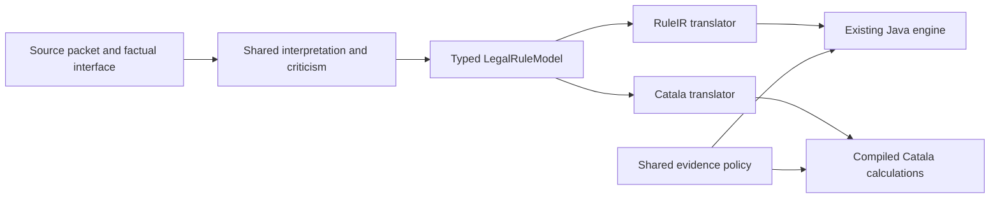

# Shared interpretation and replaceable targets

This page documents version 1. [Version 2](../translator-completion/README.md)
adds rich scope/default states, explicit rounding, library operations, helpers,
multiple generated outputs and partial observations. Existing version-1 builds
remain reproducible.

The source is interpreted once. The resulting `LegalRuleModel` contains the
selected reading, typed expressions, source references, assumptions, open
questions, and the policy for incomplete evidence. A target translator receives
that frozen model and makes no model calls.



`legalmath.translation.frontend.interpret` retains every proposed reading. A
caller selects a model file; selecting another target reuses that file. Questions,
ambiguous dimensions, deferred source units, unresolved dependencies, and adverse
source criticism block both targets. A model critic's provisional finding never
provides legal or production approval. Editing a model creates a new commitment;
the retained reading must agree with its executable expression.

The common model is broader than RuleIR. In the scalar fragment, the Catala
translator reuses the existing, tested RuleIR compatibility compiler pass. Rich
models go directly to native Catala. No RuleIR bundle is created for them.

| Feature | RuleIR target | Catala target |
| --- | --- | --- |
| Existing Boolean, integer, money and date expressions | Existing semantics | Same semantics through the compatibility compiler |
| Partial facts, unknowns, conflicts, lazy conditionals, default exceptions | Existing semantics | Same semantics through the compatibility compiler |
| Records and lists; field access, map, filter and numeric sum | Explicitly unsupported | Direct native translation |
| Exact rational decimals and decimal multiplication | Explicitly unsupported | Direct native translation |
| Known optional absence/presence and payload enum matching | Explicitly unsupported | Direct native translation |
| Rich model with partial-input semantics | Explicitly unsupported | Explicitly unsupported in this version |
| Rich outer rule scope other than literal true | Unsupported rich types | Explicitly unsupported; conditional expressions inside the body work |
| `scale` or default-exception nodes inside a rich model | Unsupported rich types | Explicitly unsupported pending a reviewed rich lowering |

Native imports, arbitrary helper scopes, calendar library operations and rounding
remain available to handwritten native programs and historical native generation.
They are not yet operators in the shared expression grammar. Recursive types are
unsupported. The shared front end currently proposes one result per reading;
handwritten models and imported RuleIR bundles may contain multiple rules. The
native translator accepts at most 40 inputs and outputs. Capability reports give
the location and reason for an unsupported construct before a build starts.

Two explicit policies are available. `ruleir.v1` preserves partial-information
RuleIR behavior. `complete.v1` requires all declared facts to be usable and applies
source validity, conflicts, missing or stale evidence, and declared numeric
bounds in that order. The policy belongs to the model, so changing the target
cannot change it. Rich native models currently require `complete.v1`.

Shared snapshots extend the RuleIR fact format. Each known fact retains type,
value, validity times, recording time and evidence IDs. Rich facts also require
`complete: true` and a top-level `evidence` map for every record field, list item
and optional/enum payload path. A known absent optional value is distinct from an
unknown fact. No evidence ID is invented. When scalar Java requires a narrower
identifier syntax, deterministic aliases and their original IDs are retained in
the result's `execution_identity_map`. Native-format snapshots are validated
before adaptation and their original snapshot hash is retained.

The command sequence is:

```text
legalmath rules interpret --task TASK.json --out INTERPRETATION --allowance EXISTING_LEDGER.json
legalmath rules translate --model MODEL.json --target ruleir --out RULEIR.json
legalmath rules translate --model MODEL.json --target catala --out CATALA.json
legalmath rules build --model MODEL.json --target ruleir --out RULEIR_BUILD --jdk JDK
legalmath rules build --model MODEL.json --target catala --out CATALA_BUILD --jdk JDK --compiler CATALA --upstream PINNED_SOURCE --lock LOCK.json
legalmath rules execute --build BUILD --snapshot SNAPSHOT.json --rule selected.control --valid-at TIME --known-at TIME --jdk JDK
legalmath rules execute --build BUILD --snapshot SNAPSHOT.json --all --valid-at TIME --known-at TIME --jdk JDK
legalmath rules resources --model MODEL.json --out resources.json
legalmath rules import-ruleir --bundle BUNDLE.json --out MODEL.json
```

`interpret` defaults to one generation/criticism pair and at most one repair
pair. It requires an existing allowance for live use. `--resume` reuses saved
responses after checking the task, code, provider route, requests and retained
files. An interrupted dispatch remains counted and is never silently repeated.
Task and provider fixture examples are in `tests/translation/support.py` and
`tests/translation/test_frontend.py`. A complete retained model and executable
build are under `artifacts/catala/modular-translation/`.

`catala-convert generate` uses this shared front end. Historical single-output
native task files use version 1 by default; multiple outputs use version 2, and
`--shared-version 2` explicitly selects it for one output. If several readings or an
unrepresented alternative remain, the command returns `AWAITING_SELECTION`;
`--reading ID --resume` selects a retained reading. Open questions still block the
build. `--legacy-code-generation` explicitly selects the historical target-code
generator. The old Python
`legalmath.catala.native.converter.convert` entry point remains that legacy API
for frozen experiments. Handwritten native `build`, `verify` and `execute` remain
available.

Each shared build retains the model, deterministic translation and underlying
build commitment. Execution rechecks those commitments and executes verified JAR
bytes. All new execution is draft-only. Release approval continues to belong to
the existing authenticated release hosts. `verify_execution` separately checks
external expected results, the full original RuleIR trace for scalar programs,
and both plain Java and the pinned interpreter for native rich programs. Expected
answers never enter interpretation or translation requests.

See the [reviewed plan](../../../plans/modular-rule-translation.md) and
[recorded results](results.md) for the engineering evidence and its limits.
