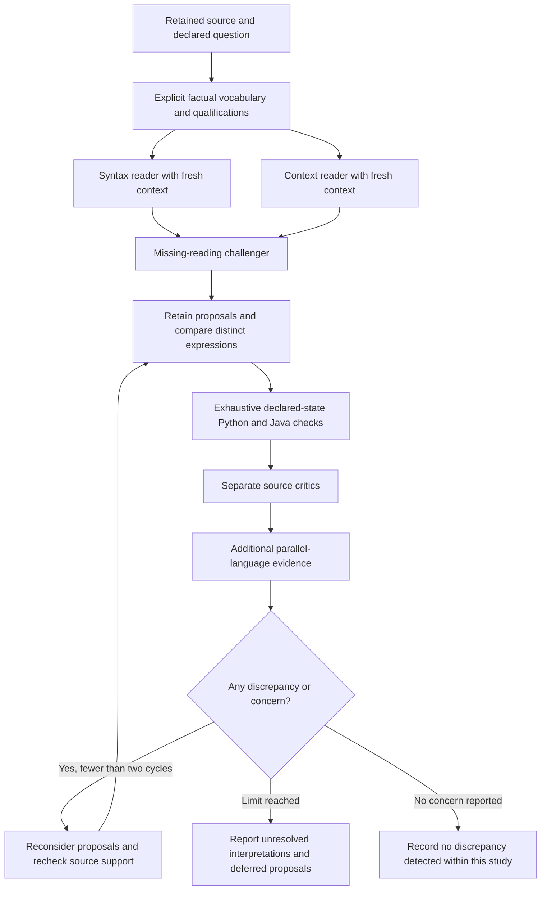

# Operating the bounded interpretation study

The study asks two different questions. The trigger study computes whether the
three supplied Q3 licensing conditions all hold. The clause study asks which
antecedent is expressed by the qualified ordinary-course sentence. A candidate
for the second question is not a complete business classifier or an exemption.
Both studies retain the full FAQ, exact quotes and assumptions.



The two initial readers receive no peer proposals. Their role labels encourage
different attention but do not establish statistical independence. The missing
reading challenger receives the retained proposals. Critics receive source
quotes, the exact expressions, declared input meanings and executed scenarios
where the programs differ. The Chinese FAQ enters only after the English-only
generation and initial criticism. Its edition relationship and legal precedence
remain explicit questions.

Every Boolean input ranges over true, false, unknown and conflict. Three inputs
therefore produce 64 declared scenarios per candidate. A Java/Python mismatch
fails the engineering check. Agreement proves only agreement on those encoded
states; whether a state describes a feasible office and whether the expression
faithfully interprets the source are separate questions.

Candidate IDs bind readings and assumptions. Exact repeats share a commitment.
Different prose describing the same program is grouped by executable behavior
after comparison. The twelve-candidate execution limit first reserves space for
different expressions; all other proposals remain stored as deferred. A question
score counts distinct behavior-group pairs separated by that scenario. It is
neither a legal probability nor a vote count.

Generation concerns, deferred hypotheses, challenged readings, missed readings,
vocabulary objections and outstanding critic questions trigger reconsideration.
The semantic loop has two cycles. Each individual task separately permits three
counted attempts to recover transport failures or invalid output. Successful
tasks resume without another call. Persistent uncertainty appears in the final
report with the entire review history; it never becomes an automatic clearance.

## Execution and evidence

The fixed supervisor is `scripts/run_issue_plan.py`. It requires a current-input
review before a phase and refreshes the successor after acceptance. A failed
phase requires a recorded executed repair before it can run again. Commands are
fixed in the runner; arbitrary model-supplied commands are not executed.

```sh
.venv/bin/python scripts/run_issue_plan.py status
.venv/bin/python scripts/run_issue_plan.py preflight
```

The current ledger is `artifacts/interpretation/round7/live-allowance.json`.
Round eight starts from 59 consumed calls and admits at most 87 more. The earlier
97-call ledger remains frozen. Failed attempts consume allowance. Do not reset
either ledger or modify accepted attempt directories.

Inspect `artifacts/interpretation/round8/state.json` for accepted phase paths.
Each live attempt retains requests, responses, validation errors, exact source,
queue snapshots, Java comparisons, summaries and file hashes. The previous
204-pair matrix remains under round seven. It has a broader coverage question
than the new eight-claim trigger check and cannot serve as a before/after legal
accuracy score.

The Java packages produced by F4 contain a proposed output descriptor naming
the exact question, reading hash, Boolean meaning and bundle. A true
`TRUE_IS_SATISFIED` result means that the declared predicate holds. The package
does not authorize its consumer to reinterpret true as compliance, prohibition
or possession of a licence. Unknown, conflict and error stay explicit. All
packages remain drafts and retain the outstanding interpretation report.
