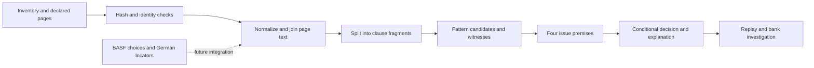

# Why the prospectus work keeps reopening

6 October 2026. Baseline: `da2c7a4336cbd1146a9d5b8896bc982d63668441`,
branch `feature/prospectus-evidence-master`. This is an investigation and proposed
delivery program. The new product implementation has not been executed.

The principal problem is the missing connection between the documents and the
meaning of the complete, operative contract. The repository has useful source
controls, bounded language recognizers, conditional financial calculations and
formal execution checks. It still lacks a single path that constructs the
selected contract, preserves its conditions across clauses and documents, and
uses independently reviewed meanings to answer a precisely scoped question.
Several recent repairs live outside the reader used by the classification
entrypoint. More downloaded documents and passing tests cannot, by themselves,
close those gaps.

This conclusion rests on traced imports, retained campaign results and seven
small new diagnostic cases. It is stronger than the observation that some cases
remain unresolved: both the installed source reader and the frozen candidate
still make incorrect feature decisions on simple constructed examples. The
proposed [delivery program](../../plans/prospectus-delivery-program-2026-10-06.md)
addresses the causes in the representation and integration of evidence.

## What is actually running

“Production reader” here means the repository reader imported by the ordinary
classification script. It does not imply that a deployed production service was
found or validated.

| Path | Actual role | Consequence |
| --- | --- | --- |
| `scripts/prospectus_master.py` → `prospectus.campaign` → `phases` | Original bounded campaign, including explicit formal premises and demonstrations | Completion concerns that campaign's defined phases |
| `scripts/run_prospectus_evidence_master.py` → `master_control`, `evidence_continuation` or `evidence_closure` | Later acquisition, repair, classification and investigation campaigns | These are different dispatch paths, not one new prospectus product |
| `master_phases.run_corpus` → `scripts/run_bond_loss_absorption_classification.py` → `src/legalmath/prospectus/loss_absorption_reader.py` | Ordinary issue classification | Source metadata and declared page ranges feed the fragment reader |
| `feature_investigation.investigate` → replay → `eligibility.investigate` and optional instrument profile | Existing downstream bank integration | It deliberately preserves 14 obligations and makes no automatic feature-to-regulatory-scope implication |
| `scripts/prospectus_corner_repair_worker.py:11` inserts the frozen candidate's `src` | Isolated 4 October candidate, including cancellation, intake and external-law additions | These additions do not become active in the ordinary reader by being committed |
| `scripts/prospectus_refresh_admission.py:178` imports that frozen candidate | Optional qualified extraction admission | Three Deutsche pages can be consumed here; the production reader is unchanged |
| `scripts/prospectus_basf_admission.py:185` | Validated BASF selection view | It exposes choices and clause locators, explicitly not composed operative text |

The main CLI has substantial rule and assurance functionality, but no integrated
prospectus command covering this whole path. The separate
`docs/plans/legal-interpretation-master-program.md` is explicitly an unexecuted
specification for another pilot. Its reusable ideas do not constitute an
implemented prospectus solution.

The relevant reader path is:



`load_document` checks identities, hashes, page numbering and preliminary status.
`joined` normalizes whitespace; `segments` splits at selected punctuation and
contains narrow repairs for coordinated and numbered clauses. `clause_features`
and `semantic_features` recognize supported patterns. `analyze_issue` reduces the
records to debt, write-down, common-share conversion and coverage premises.
The formal decision is conditional on those premises. No later proof reconstructs
conditions or authorities lost before that reduction.

## What the completed campaigns establish

The 5 October [delivery summary](../prospectus-delivery-2026-10-05/FINAL-SUMMARY.md)
and [integration verification](../prospectus-delivery-2026-10-05/INTEGRATION-VERIFICATION.md)
record completed engineering and Git delivery. Branch synchronization is closed.
Historical work orders saying “uncommitted” describe their original run state.

OCR recovered text for the seven fixed offering inputs after 17 BES scan pages,
18 reviewed images and 23 corrections. The retained legal readings remain five
abstentions and two conditional positives. The BASF continuation accounts for
55 checkboxes and eight bilingual responses, and records 37 visually reviewed
pages and 92 annual-report pages admitted for identity and incorporation scope.
Its code still explicitly returns `full_german_contract_constructed: false` and
`legal_answer: null`. These are useful and accurately qualified achievements.

The 186-test continuation suite includes the earlier 123 tests. The frozen
candidate's 885-test result is another suite/run; adding the counts would not
measure accuracy. No full regression suite was rerun for this investigation.

The review queue still contains 1,467 issue-level records grouped into 1,307
source spans. Grouping identical text is useful for work allocation, but the
same text can have different issue selections, amendment histories and legal
contexts. The 25 independent legal-review forms remain unassigned.

## New counterexamples

Command actually run:

```text
python3 -m scripts.audit_prospectus_root_causes
```

The script runs each reader in a separate Python process and records its actual
import path and hash. Inputs, complete outputs, source hashes and environment
are retained in [probes/manifest.json](probes/manifest.json). The source is
[audit_prospectus_root_causes.py](../../../scripts/audit_prospectus_root_causes.py).
These are constructed debugging cases, not independently adjudicated contracts
or an estimate of population accuracy. “Yes” below means the reader's qualified
loss-feature answer, not an actual loss event.

| Diagnostic | Ordinary reader | Frozen candidate | Required behavior |
| --- | --- | --- | --- |
| Cash repayment with no loss provision in the explicitly supplied synthetic scope | No | No | Preserve this negative control |
| Explicit principal write-down on a trigger | Yes | Yes | Preserve the conditional feature control |
| Additional blank operative page | No | Unresolved | Prevent a negative until extraction coverage is resolved |
| “the Issuer's obligation to repay the principal of the Notes ceases permanently without payment” on a solvency event | No | No | Recognize the unpaid cessation or leave it unresolved |
| Payment obligations “subject to Condition 14 of the Agency Agreement,” with that condition unprovided | No | No | Resolve the referenced condition before giving a negative |
| A conversion sentence expressly described as a non-operative example with no legal effect | Yes | Yes | Do not promote the example to an operative power |
| “Conversion is solely at the holder's option,” followed by conversion on exercise of that option | Yes | Yes | Retain the holder's election across sentences |

The candidate resolves the blank-page defect. Four semantic/dependency failures
remain in both readers. The failure is not simply excessive abstention: the
readers can answer both yes and no for the wrong reasons.

## Root causes and repairs

The code paths below are relative to this checkout. Line anchors refer to the
inspected baseline; the new program will bind file hashes before implementation.

| ID | Observed cause and evidence | Why local patches recur | Required repair and discriminating check |
| --- | --- | --- | --- |
| R01 | `loss_absorption.py:8` has four premises for one feature question; broader campaigns also discuss complexity, sale eligibility, legal measures and recovery | “Deliver this part” can expand without a fixed acceptance unit | Version the questions and output meanings. Test that feature presence does not imply event occurrence, legal applicability, eligibility or recovery |
| R02 | `loss_absorption_reader.py:21,213,241` flattens pages and splits fragments; retained BASF margins and Deutsche columns need separate treatment | Correct characters can still produce incorrect reading order and condition scope | Preserve page geometry, paragraphs, list parents, languages and annotations. Compare reconstructed units against reviewed page images and adversarial layout fixtures |
| R03 | `analyze_issue:361,386` uses declared documents and dependencies; candidate `document_intake.py:28` permits an undeclared bundle | Unknown references do not automatically become requirements; an absent condition can disappear | Build a typed source/dependency graph and query-specific completeness record. The unprovided-Condition-14 probe must block the affected answer without a manually supplied “missing” phrase |
| R04 | `prospectus_basf_admission.py:111–117,159–169,185–199` binds choices to incomplete locators | Checkbox completion is mistaken for progress on contract composition | Construct the selected text with every deletion, substitution, retained condition and cross-reference traceable to its source. Preserve BASF's conditional successor guarantee, change-of-control put and clean-up call conditions |
| R05 | `loss_absorption_witnesses.py:82` recognizes local patterns with finite look-behind; `reader_scope.py` contains exact source constructions | Actor, election, exception and antecedent scope are repaired phrase by phrase | Use a typed clause graph with explicit inherited scope and alternative readings. Require the example and holder-option probes, distant exceptions and issuer/holder swaps to pass |
| R06 | `loss_absorption_reader.py:397–404` sets a mechanism false when no positive and no recognized unresolved record exists | Unrecognized wording becomes apparent absence; cash repayment supplies the other ingredient | Every operative unit starts unevaluated. A negative needs a reviewed disposition of all material units/dependencies. The cessation probe must never yield a negative merely because no pattern fires |
| R07 | `validate_semantic_witness:135` calls `semantic_features`; derivation checking invokes that validator | Two agreeing executions share the same interpretation error | Keep replay for integrity, add an independently specified semantic oracle and independently adjudicated real-source labels. Mutation tests must change the expected meaning, not only a checksum |
| R08 | Candidate `external_law.py:94` evaluates supplied rules/context; `prospectus_refresh_semantics.py:48` admits one exact disclosure. Candidate intake rejects every document dated after issuance | Anchored declarations are not discovered/applicable law; issue-time assembly and later legal history require different time models | Reuse `LegalVersion`'s separate validity/knowledge idea; model issue formation, amendments, event, forum, authority, recognition and procedure separately. Dated counterfactuals must change only the relevant legal conclusion |
| R09 | `closure_mechanisms.py:11,56,96,130` has three edition-specific profiles; UBS has a separately guarded profile; BES functions are optional | Exact arithmetic is mistaken for complete financial semantics or actual inputs | Reuse these guarded kernels, complete each advertised profile's source derivation, units, rounding, calendar, corporate action and settlement inputs. Unsupported profiles remain explicitly unsupported |
| R10 | Candidate path insertion and optional loaders above; BASF consumer never returns operative text | Successful work can remain unreachable through the supported entrypoint | One successor service and explicit adapters. Run source mutation through CLI → report → bank obligations; verify imports and installed-package behavior |
| R11 | Original queue and unassigned forms; exposed repairs and small challenge sets | The method can satisfy its own fixtures without demonstrating usefulness on new families | Start annotation and cohort curation in P0. Evaluate false positives, false negatives, qualifier preservation and abstention with fixed denominators and paired baselines |
| R12 | BASF phases end with `BOUNDED_PHASES_VERIFIED`; its next work order says `implementation_exists:false` | Phase completion and refreshed prose do not implement the next missing capability | One dependency-driven controller with implemented-handler checks, bounded causal repair and separate engineering/evidence/release status. An absent handler or pending reviewer must never be recorded as complete |

R08 identifies a boundary of the issue-formation validator, not proof that its
original pre-issue check was wrong. Later amendments need their own supported
path. Likewise R09 is a capability gap, not a finding that all existing numerical
formulas are incorrect. These distinctions matter when deciding what to retain.

## Why the next program should be different

The earlier plans already stated several correct principles: source-bound
witnesses, independent checks, explicit unknowns and fresh validation. Their
implementations delivered bounded constructions and source controls while leaving
the difficult composition and interpretation steps for later. The next program
must turn those principles into interfaces and end-to-end exit tests.

The proposed design has four main products: an assembled contract with a source
map, a typed account of its provisions and unresolved readings, a separately dated
legal/factual assessment, and a report produced from those same checked results.
Existing exact arithmetic and formal backends remain useful. A new general
ontology, new theorem prover or larger language model is not a prerequisite.

Independent review is a real resource requirement. The coding agent can prepare
the packets, resolve extraction and implementation defects, and organize the
review queue. It cannot fill an independent legal-review field itself. Source
acquisition can also remain blocked despite sound engineering. The program names
these dependencies early and continues unrelated engineering work while keeping
the affected delivery items open.

The literature review supports this direction but does not prove that the new
design will succeed. ContractNLI deliberately excluded scanned and multicolumn
PDFs, and its difficult cases include distant exceptions. SARA's extraction study
shows why missing arguments matter to downstream reasoning. Catala's compiler
proof starts with formal representations, not the original prose. These are
reasons to test each transition in our own prospectus setting.

## Investigation decision

| Decision | Primary criterion | Veto evidence | Main uncertainty | Next action | Unsupported conclusion |
| --- | --- | --- | --- | --- | --- |
| Replace piecemeal closure with the proposed integrated program | Actual paths, existing evidence and reproducible counterexamples identify specific causes | Four shared feature failures prevent promoting either reader as a general interpreter | Which new representations and reviewer protocol achieve adequate coverage | Implement P0/P1, then complete source-to-answer slices | General legal accuracy or automatic transaction permission |
| Retain completed source and numerical work | Source-bound admission, conditional profiles and recorded regressions remain useful | No new probe invalidated those separately bounded results | Applicability outside their declared scope | Adapt them explicitly and revalidate consumers | All old tests are independent semantic evidence |
| Keep the redesign an unexecuted proposal | Interfaces, phase dependencies and acceptance tests are concrete | Product handlers and external acceptance do not exist yet | Reviewer capacity and unavailable primary instruments | Use the reviewed specification as the implementation baseline | A checked plan is an executable delivered product |

Strongest alternative explanation: some real abstentions are caused primarily by
incomplete dossiers rather than language recognition. That is consistent with
the retained results. It does not explain the four complete-text or referenced-
condition probe failures, and the program addresses both causes. A successor
that fixes the probes but still loses conditions on independently reviewed real
documents would overturn a general semantic-repair claim. The weakest current
evidence remains real-source adjudication and unseen-family performance.
